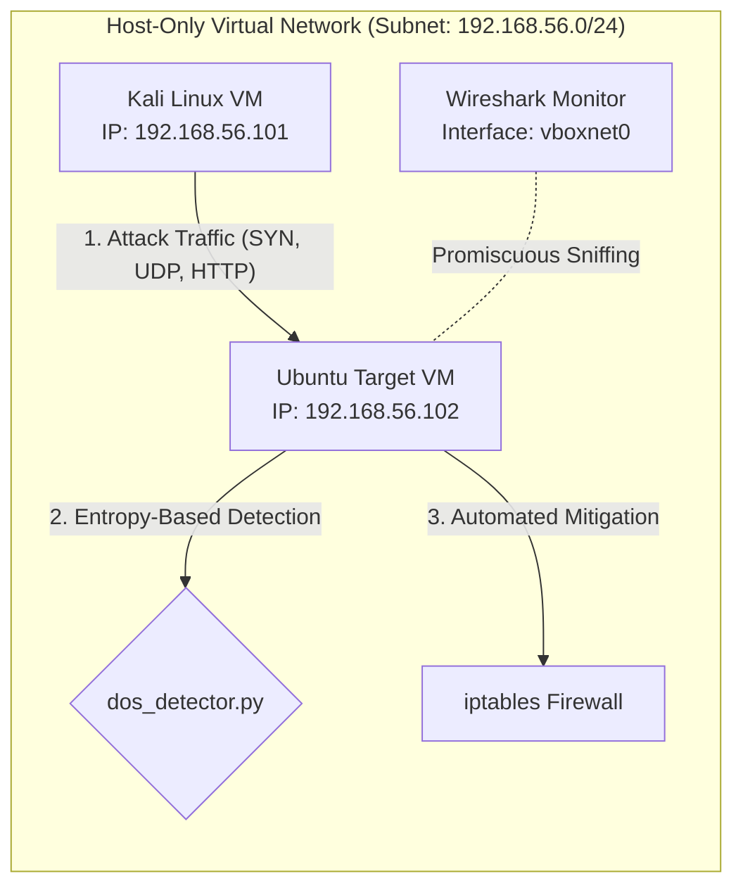

# Cybersecurity Virtual Lab: DoS/DDoS Detection and Prevention

This directory contains functional Python scripts to demonstrate real-world network reconnaissance, packet analysis, intrusion detection, and host defense mitigation. This guide walks you through setting up an isolated virtual sandbox to run these utilities safely.

---

## 1. Laboratory Virtual Architecture

To audit network defenses securely, build an isolated virtual network consisting of at least two nodes:



### Components
1. **Attacking Node**: Kali Linux (holds `attack_generator.py`).
2. **Victim / Defensive Node**: Ubuntu Server or Debian VM (runs `dos_detector.py` and `dos_mitigator.py`).
3. **Network Analyzer**: Wireshark (capturing on the host's virtual adapter or locally on the target VM).

---

## 2. Virtual Sandbox Installation and Setup

Follow these steps using **VirtualBox** (or VMware equivalents) to deploy the sandbox:

### Step A: Configure a Host-Only Network
1. Open VirtualBox and navigate to **File** -> **Tools** -> **Network Manager**.
2. Click **Create** to initialize a host-only interface (usually named `vboxnet0` on macOS/Linux or `VirtualBox Host-Only Ethernet Adapter` on Windows).
3. Set the IPv4 Adapter Address to `192.168.56.1` and subnet mask to `255.255.255.0`.
4. Enable the **DHCP Server** tab, setting the address boundaries (e.g., `192.168.56.100` to `192.168.56.200`).

### Step B: Configure the VMs
1. Install **Kali Linux** as the attacking machine and **Ubuntu Server** as the target.
2. In VirtualBox, open **Settings** for each VM.
3. Under the **Network** category, change the Adapter type to **Host-Only Adapter** and choose the name of the host-only interface created in Step A (`vboxnet0`).
4. Boot both VMs. Verify connection by running `ping` between the machines.
   * *Kali IP*: `192.168.56.101`
   * *Ubuntu IP*: `192.168.56.102`

---

## 3. Wireshark Network Traffic Analysis

Wireshark allows you to visually inspect packet floods and identify specific protocol flags.

### Capturing Traffic
* Launch Wireshark on the Host or the Target.
* Double-click the virtual interface (`vboxnet0` or the VM's active network adapter).
* Start the attack generator and look for specific patterns:

### Protocol Visual Auditing

#### A. TCP SYN Flood
* **Pattern**: An overwhelming volume of TCP packets marked with the `[SYN]` flag, all directed to a single port (e.g., `80`). Source IP addresses may be highly randomized (spoofed) or a single IP. There will be an absence of completing handshake packets `[SYN-ACK]` or `[ACK]`.
* **Wireshark Display Filter**: 
  ```text
  tcp.flags.syn == 1 && tcp.flags.ack == 0
  ```

#### B. UDP Flood
* **Pattern**: A continuous sequence of large UDP packets targetting randomized or specific ports. The target server will likely reply with ICMP error packets indicating the port is closed.
* **Wireshark Display Filter**:
  ```text
  udp || icmp.type == 3
  ```

#### C. HTTP GET Flood
* **Pattern**: Massive volumes of standard HTTP request strings (`GET / HTTP/1.1`) originating from one or more IPs, aiming to exhaust application pool worker threads.
* **Wireshark Display Filter**:
  ```text
  http.request.method == "GET"
  ```

---

## 4. Sniffing and Detecting Anomalies

Run the detection script on the target VM to monitor rates and measure the distribution entropy of source IP addresses:

```bash
# Clone/Copy scripts to the Ubuntu target VM, then run:
sudo python3 dos_detector.py -i eth1 -t 150
```
*(Replace `eth1` with the active host-only interface name on the target VM)*

### Reading Entropy Values
The detector tracks the distribution of source IPs to categorize the threat:
* **Low Entropy (< 1.2)**: Packets are coming from a highly concentrated source. This indicates a **Single-Source DoS Attack** (e.g., standard SYN or UDP flood from a single attacker).
* **High Entropy (> 3.5)**: Packets are distributed across hundreds of random IP addresses. This signals a **Spoofed/Distributed DDoS Attack**, where the attacker is randomized or employing a botnet.

---

## 5. Live Mitigation with iptables Firewall

When an anomaly is flagged, use `dos_mitigator.py` to write stateful filter rules inside the Linux kernel.

### A. Block a Specific Attacker IP
If the detector reports a single IP dominating traffic (e.g., `192.168.56.101`):
```bash
sudo python3 dos_mitigator.py block 192.168.56.101
```
*Effect*: Creates an `iptables` rule that completely drops all incoming traffic from that source IP.

### B. Implement Port-Level Rate Limiting
To prevent legitimate servers from collapsing while keeping ports accessible, apply connection rate limits:
```bash
sudo python3 dos_mitigator.py limit --rate 25/second --burst 50 --port 80
```
*Effect*: Standard requests are accepted up to the burst limit, but excessive packet rates are blocked, preserving server threads.

### C. Restrict Maximum Concurrent Connections
Prevent attackers from hogging sockets (e.g., Slowloris style attacks) by limiting concurrent TCP connections per IP:
```bash
sudo python3 dos_mitigator.py limit --conn 10 --port 80
```
*Effect*: Resets (`RST`) connection attempts once an IP exceeds 10 active connections.

### D. Activate Kernel TCP SYN Cookies Protection
To fully mitigate massive SYN floods without allocating connection buffers for uncompleted handshakes:
```bash
sudo python3 dos_mitigator.py syncookies on
```
*Effect*: Sets the kernel sysctl flag `net.ipv4.tcp_syncookies = 1`, making the server use cryptographic hashes in the TCP Sequence number to validate handshakes before allocating memory.

### E. Monitor and Flush Rules
Check active rules and trace drop counts:
```bash
sudo python3 dos_mitigator.py list
```
To remove all defensive rules and restore normal routing:
```bash
sudo python3 dos_mitigator.py clear
```

---

## 6. Real-World Execution Step-by-Step Flow

To test the entire cycle inside your sandbox:

1. **Start Detector on Victim (Ubuntu)**:
   ```bash
   sudo python3 dos_detector.py -i eth1 -t 100
   ```
2. **Launch Attack from Attacker (Kali)**:
   ```bash
   python3 attack_generator.py 192.168.56.102 -m syn -p 80 -t 4
   ```
3. **Analyze**: Look at the victim terminal. You will see the PPS spike, the IP entropy drop near `0.0`, and flashing `ALERT (DoS)` red warnings.
4. **Deploy Defense (Ubuntu)**: Open a second terminal on Ubuntu and apply SYN Cookies and block the IP:
   ```bash
   sudo python3 dos_mitigator.py syncookies on
   sudo python3 dos_mitigator.py block 192.168.56.101
   ```
5. **Verify**: Watch the detector terminal. The PPS of incoming traffic drops back to normal levels, and server resources are immediately restored!
